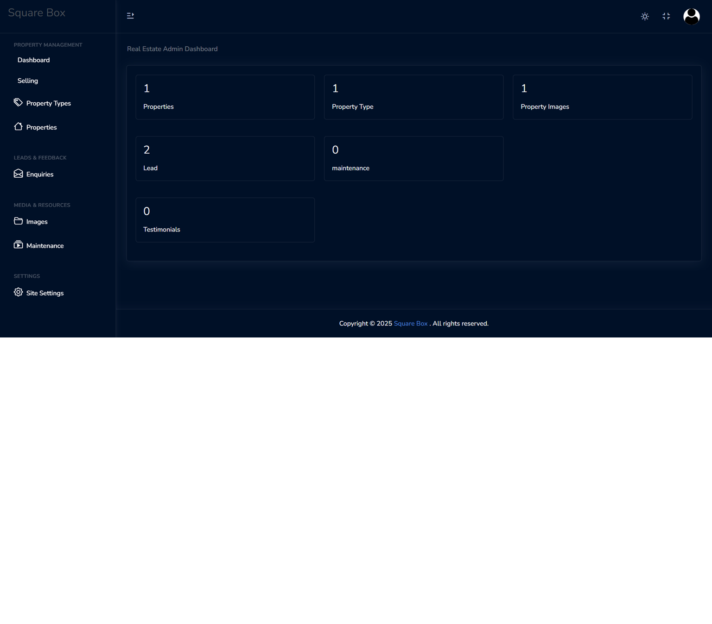
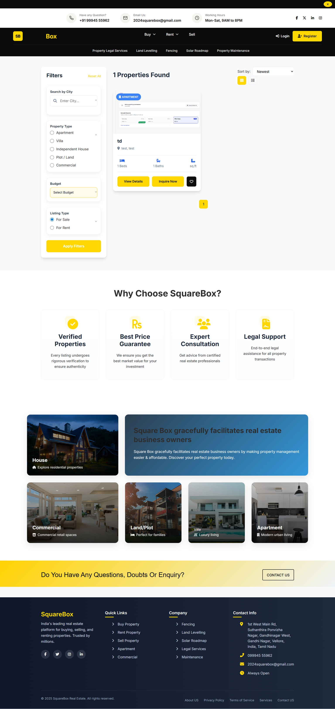
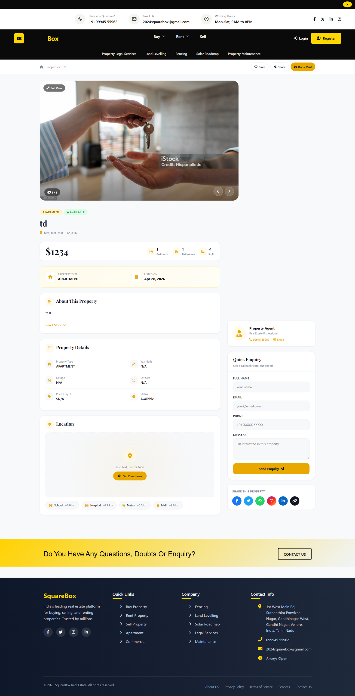

# Django Real Estate Platform

Live Demo: https://squarebox.mckbytes.in/

---

## Project Overview

This project is a full-stack real estate web application developed using Django, Django REST Framework, and SQL. It allows users to register, list properties, and explore options to buy or rent properties through a structured and scalable platform.

The application is designed to handle real-world property workflows including property management, land tracking, and API-driven data handling.

---

## Features

* User registration and authentication
* Property listing and management
* Buy and rent property functionality
* Land details and tracking system
* REST API integration for data operations
* Admin panel for managing properties
* Responsive user interface

---

## Tech Stack

### Backend

* Python
* Django
* Django REST Framework

### Frontend

* HTML5
* CSS3
* Bootstrap
* JavaScript

### Database

* SQL (SQLite / PostgreSQL)

### Tools

* Git and GitHub
* Postman
* Visual Studio Code

---

## Project Screenshots

### Admin Page

### Home Page

### Property Listing

### Property Detail Page

---

## Important Note

---

## Project Structure

django-real-estate-platform/
│── app/              Django applications
│── templates/        HTML templates
│── static/           CSS, JS, images
│── img/              Project screenshots
│── manage.py
│── README.md

---

## Installation and Setup

### Clone the repository

git clone https://github.com/your-username/django-real-estate-platform.git

### Navigate to project folder

cd django-real-estate-platform

---

### Setup Environment

Create virtual environment:
python -m venv venv

Activate environment:
venv\Scripts\activate

---

### Install Dependencies

pip install -r requirements.txt

---

### Database Setup

python manage.py migrate

---

### Run Server

python manage.py runserver

---

### Access the Application

http://127.0.0.1:8000/

---

## Future Enhancements

* Payment integration for property booking
* Advanced search and filtering
* Map-based property location
* Notification system
* Analytics dashboard for admin

---

## Security Note

For security reasons, sensitive configuration files, environment variables, and server-related settings are not included in this repository.

If access is required for review or collaboration, please contact:
[bharath122020@gmail.com](mailto:bharath122020@gmail.com)

---

## Author

Bharath A
Full Stack Developer
Vellore, India

---

## Support

If you find this project useful, consider starring the repository and sharing your feedback.
